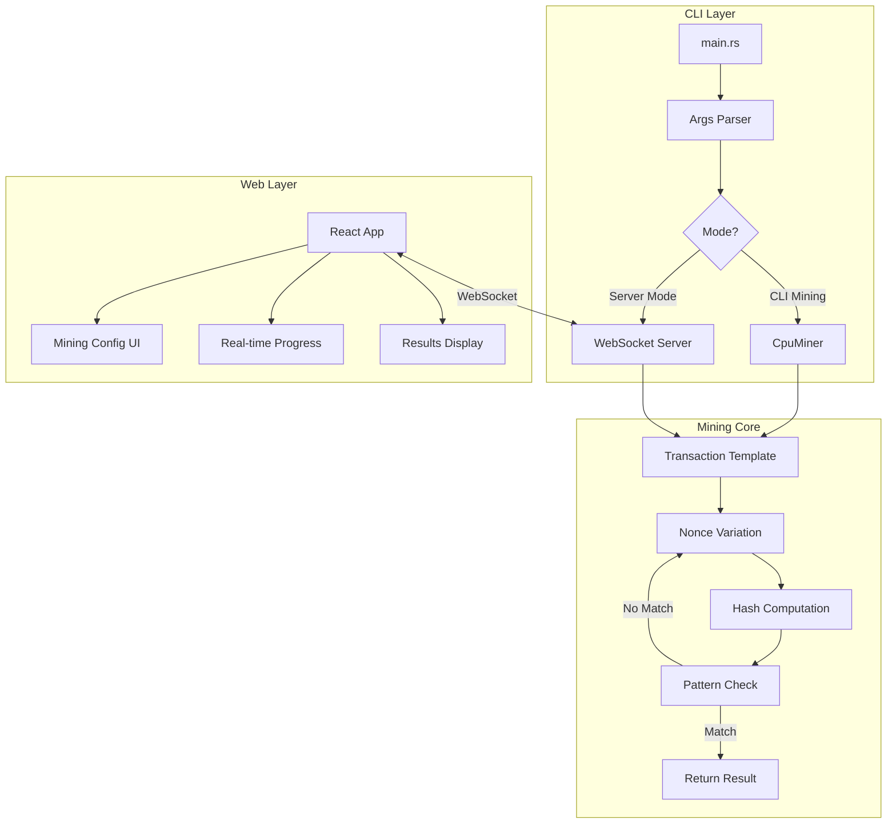
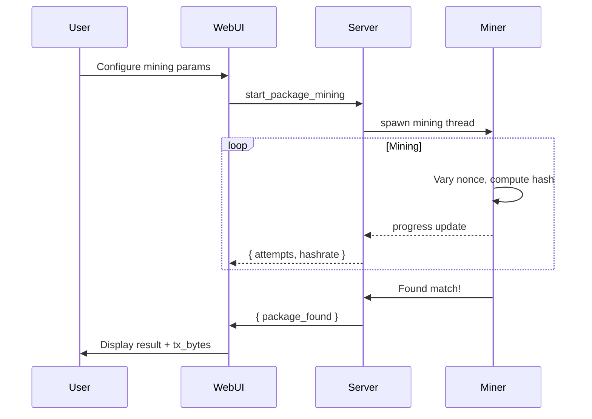

# Sui Package ID Miner - Technical Design Document

**Authors:** Kay-79  
**Status:** Implemented  
**Created:** 2026-01-18

---

## Summary

Sui Package ID Miner is a high-performance CPU-based tool for mining custom (vanity) Package IDs when publishing Move packages on the Sui blockchain. It enables developers to obtain memorable Package IDs like `0x0000...`, `0xcafe...`, or `0xdead...` by brute-forcing transaction parameters until a matching Package ID is derived.

---

## Goals

| Goal | Description |
|------|-------------|
| **Vanity Package IDs** | Mine for specific hex prefixes (e.g., `0x00...`, `0xcafe...`) |
| **100% On-Chain Verified** | Use official `sui-types` SDK logic to ensure derived IDs match the Sui network exactly |
| **Multi-threaded Performance** | Utilize all available CPU cores for maximum hashrate |
| **Web Interface** | Provide a modern web UI for easy access without CLI knowledge |
| **Real-time Feedback** | Display live hashrate, attempts, and progress |

---

## Background

### Sui Package ID Derivation

On Sui, Package IDs are deterministically derived from the transaction that publishes them:

```
PackageID = Sha3_256(TransactionDigest || ObjectIndex)
```

Where:
- `TransactionDigest = Blake2b256(IntentBytes || BCS(TransactionData))`
- `ObjectIndex` = 0 for the Package (first object created by Publish transaction)

### Key Insight

By varying a "nonce" field in the transaction (specifically, the `gas_budget` parameter), we can generate different `TransactionDigest` values, which in turn produce different Package IDs. The `gas_budget` can vary within a valid range without affecting the actual transaction execution.

---

## High Level Design



### Components

| Component | File | Description |
|-----------|------|-------------|
| **CLI Entry** | `main.rs` | Command-line argument parsing and orchestration |
| **CPU Miner** | `cpu_miner.rs` | Multi-threaded mining using Rayon |
| **Target Checker** | `target.rs` | Efficient hex prefix matching |
| **WebSocket Server** | `server.rs` | Real-time communication with Web UI |
| **Web UI** | `app/` | React frontend with Neo-Brutalism design |

---

## Detailed Design

### 1. Transaction Template Creation

```rust
fn create_tx_template(
    sender: SuiAddress,
    module_bytes: Vec<Vec<u8>>,
    base_gas_budget: u64,
    gas_price: u64,
    gas_payment: (ObjectID, SequenceNumber, ObjectDigest),
) -> Result<(Vec<u8>, usize)>
```

1. Build a `ProgrammableTransaction` with `publish_upgradeable` command
2. Add dependencies (`0x1` stdlib, `0x2` framework)
3. Transfer the `UpgradeCap` to sender
4. Serialize to BCS format
5. Locate the `gas_budget` offset in the byte array

### 2. Mining Algorithm

```rust
// For each nonce (0..∞):
let varied_gas_budget = base_gas_budget.wrapping_add(nonce);
tx_bytes[nonce_offset..nonce_offset + 8] = varied_gas_budget.to_le_bytes();

// Deserialize and compute digest
let tx_data: TransactionData = bcs::from_bytes(&tx_bytes)?;
let tx_digest = tx_data.digest();  // Blake2b256(Intent || BCS)

// Derive Package ID (Index 0 only)
let package_id = ObjectID::derive_id(tx_digest, 0);  // Sha3_256(digest || 0)

// Check prefix match
if target.matches(&package_id.into_bytes()) {
    return Some(MiningResult { ... });
}
```

### 3. Parallel Processing

Using Rayon for CPU parallelism:

```rust
let batch_size = 100_000u64;
(0..batch_size).into_par_iter().find_map_any(|i| {
    // Each thread processes a portion of the batch
    // First match returns immediately
})
```

### 4. Prefix Matching Optimization

```rust
impl TargetChecker {
    #[inline(always)]
    pub fn matches(&self, id_bytes: &[u8; 32]) -> bool {
        // Compare full bytes first
        let full_bytes = self.prefix_len / 2;
        if id_bytes[..full_bytes] != self.prefix_bytes[..full_bytes] {
            return false;
        }
        
        // Check half-byte (nibble) for odd-length prefixes
        if self.prefix_len % 2 == 1 {
            let expected_nibble = self.prefix_bytes[full_bytes] >> 4;
            let actual_nibble = id_bytes[full_bytes] >> 4;
            return expected_nibble == actual_nibble;
        }
        
        true
    }
}
```

### 5. WebSocket Protocol

**Client → Server Messages:**

```json
{
  "type": "start_package_mining",
  "prefix": "cafe",
  "modules_base64": ["<base64 .mv bytecode>"],
  "sender": "0x...",
  "gas_budget": 100000000,
  "gas_price": 1000,
  "gas_object_id": "0x...",
  "gas_object_version": 123,
  "gas_object_digest": "<base58>",
  "threads": 8
}
```

**Server → Client Messages:**

```json
// Progress (every 500ms)
{ "type": "progress", "attempts": 1234567, "hashrate": 45000.0 }

// Found
{ "type": "package_found", "package_id": "0xcafe...", "tx_bytes_base64": "..." }
```

---

## Data Flow



---

## Performance Characteristics

| Metric | Value |
|--------|-------|
| Batch Size | 100,000 iterations |
| Progress Update | Every 500ms |
| Threading | All CPU cores (configurable) |
| Hash Rate | ~50-200K/s per core (depends on CPU) |

### Mining Difficulty Estimates

| Prefix Length | Possibilities | Average Attempts | Estimated Time (100K/s) |
|---------------|---------------|------------------|-------------------------|
| 1 char | 16¹ | 8 | <1 second |
| 2 chars | 16² | 128 | <1 second |
| 3 chars | 16³ | 2,048 | <1 second |
| 4 chars | 16⁴ | 32,768 | <1 second |
| 5 chars | 16⁵ | 524,288 | ~5 seconds |
| 6 chars | 16⁶ | 8,388,608 | ~84 seconds |
| 7 chars | 16⁷ | 134,217,728 | ~22 minutes |
| 8 chars | 16⁸ | 2,147,483,648 | ~6 hours |

---

## Security Considerations

| Consideration | Mitigation |
|---------------|------------|
| **Private Key Safety** | Package mining does NOT require private keys. Only transaction bytes are generated. User signs separately. |
| **Gas Object Binding** | Results are specific to the exact gas object (ID, version, digest). User must use the same gas object when signing. |
| **Local Execution** | Server runs on `127.0.0.1` only. No external network exposure. |

---

## Testing

### Unit Tests

```bash
cd cli
cargo test
```

Tests cover:
- Prefix matching (full bytes and nibbles)
- Transaction template creation
- Package ID derivation

### Integration Testing

1. Start server: `cargo run --release -- --server`
2. Start web app: `cd app && npm run dev`
3. Connect and verify mining workflow

---

## Future Improvements

| Improvement | Description |
|-------------|-------------|
| **GPU Acceleration** | OpenCL/CUDA for 10-100x speedup |
| **WASM Mining** | Browser-based mining for distributed workload |
| **Custom Patterns** | Support for suffix, contains, or regex patterns |
| **Multiple Targets** | Mine for any of several prefixes simultaneously |

---

## References

- [Sui Types SDK](https://github.com/MystenLabs/sui/tree/main/crates/sui-types)
- [Object ID Derivation](https://docs.sui.io/concepts/object-model)
- [Transaction Data Structure](https://docs.sui.io/concepts/transactions)
